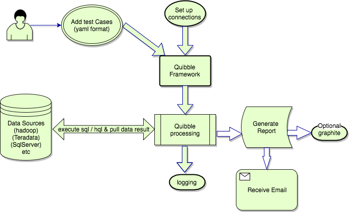

# Quibble

## Overview
Quibble is a data validator tool to allow testers, developers and analysts to define and execute test-cases involving data. Quibble is able 
to compare data from one or more data platforms, assert on the outcome, highlight any data differences and produce generated report output. 
Commonly used test scenarios such as sampling queries and minus query output can be easily automated and validated.
Data ETL testing, migration testing and database upgrade testing are the key areas where Quibble can be utilised the most.
In principle, you can use Quibble to test data on some of the common data sources like below. In fact, Quibble can be utilised on any 
relational database that can be connected via JDBC drivers.
- Hive
- db2
- Teradata
- SQLserver
- Shell
- Mysql
Quibble has been tested with Hive version 1.2, Teradata, shell and SQLserver environments.
## Workflow

## Installation
Build Quibble via ` mvn clean package `
Once maven build is performed, Quibble can be made available as a RPM Package to be installed. Yum can be used to install Quibble as shown 
below.
```sh 
sudo yum install quibble 
```
Please note : Quibble requires JRE Version 7 and above to be available on the system.
## Configuration
Once installation is complete, the configuration needs to be set up under ` /opt/quibble/conf `
To use Quibble, you need to:
### Set up a connection to the data source
##### Step 1 : Create a connections configuration file 
In the directory ` /opt/quibble/conf `, create a file called connections.yaml (connections.yml may also be used).
##### Step 2 : Configure file
In the newly-created file, add the platform, URL, username, password and driver, following the examples below. You can specify multiple 
platforms, separating them with three hyphens (-), as in the examples. Note that the first platform must also start with (---).
The property keys (platform, url, username…) are case sensitive and have to be lowercase as shown below.
```yaml
---
platform: hive
url: jdbc:hive2://hive.server.url:portnumber/
username: YourHiveUsername
password: YourHivePassword
driver: org.apache.hive.jdbc.HiveDriver
---
platform: teradata
url: jdbc:teradata://teradata-server-url/CHARSET=UTF8
username: TeradataUserName
password: TeradataUserPassword
driver: com.teradata.jdbc.TeraDriver
```
### Defining a location to save the log files
Test case execution status messages and output can be optionally logged in log files and printed on the console. Quibble framework uses 
SLF4J(http://www.slf4j.org) with Apache Log4j (http://logging.apache.org/log4j/) logging mechanism. Logging configurations can be provided by 
log4j.xml file.
There are ways to specify the log file location:
-    By defining an environment variable, which allows you to set the log file at runtime
-    You could also pass custom log4j.xml with details on the classpath
Defining the log file path by setting an environment variable at runtime
In an XML editor, open `/opt/quibble/conf/log4j.xml` 
Within the `<appender>` node for the action you want to be logged, edit the file parameter to contain the Log_output_file environment 
variable. You may need to add a new parameter node if it doesn’t already exist.
`<param name="file" value=" ${Log_output_file}"/>`
### Defining the tests you want to run
To define a Quibble test, you need to create a new YAML file. In the file, you will set:
-    the test type
-    the test name
While it is best practice for the test name to be unique, it doesn't have to be, unless you enforce this rule with the 
checkDuplicateTestNames parameter when you run the test. 
-    a description to help you describe the test (optional)
-    the actions
Actions specify the command(s) to be run, for example a SQL query, and which platform(s) to run it on. 
The platform must match a platform name in the connections.yaml file you created earlier.
#### Supported test types
The following test types are supported:
###### -  zero_count : 
For this test type to pass, all queries and commands in the test must return zero for the test. This is useful to check for null values, or 
to check for duplicates.
###### -  count_match : 
For this test type to pass, all queries and commands in the test must return the same single numeric value. This is useful to check whether 
there are exactly the same number of rows between two copies of the data stored on different platforms.
###### -  count_match_with_threshold : 
This test type is similar to count_match, except that the test will pass if the data is different but within a certain percentage tolerance.
 
The difference percentage is in fact a percentage decrease which is calculated with respect to largest value returned by the actions. For 
example, if a test case contains three actions and threshold difference is allowed to be 10%, and suppose the first action returns 1000 and 
the second actions returns 800 and the third action returns 900, then the percentage difference will be calculated between the highest (1000) 
and the lowest (800) number such that it is a percentage decrease, which in this case is 20%. Since 20% is higher than 10% allowed for this 
test case, this test case fails.
This is useful if the two data sources should be the same but one might be slightly delayed with respect to the other, so you are willing to 
accept a small difference in the volume of data.
###### -  data_match : 
For this test type to pass, all the returned data, in both columns and rows, must match each other. This match can be for any data type. You
 aren't limited to numeric values.
Currently, only two queries per test case are supported. If you need to compare data between more than two queries, break down your test 
case into multiple test cases. Although there is no limit on the amount of data returned, Quibble may take a long time if there is a lot of 
data to match.
###### -  keyed_threshold : 
This testype allows the calculation of data to identify difference between the returned numeric values for each columns, from the given 
tables, and reports if it is within or not a permitted threshold percentage defined individually based on the column index. The difference 
percentage is calculated based on the difference in column value from one table when compared to the column value from other table. The 
thresholds are defined individually for each columns based on the column position/index.
For example, if threshold difference for a column value based on index is allowed to be 5% and suppose if the first column returns 120 and 
the other column of the same position returns 130 from another table then the percentage difference will be calculated between the highest 
and lowest column values, and suppose if it is within the specified 5% threshold, then the test case passes.
column 1 from table A - 140
column 1 from table B - 130
then diff percentage is 7.14 based on 140-130/(140*100)
Suppose the threshold value for this column index is set to 5%, then this test fails
#### Example Quibble test YAML file
Below are the examples of each of these test types. The sample of each test starts with three hyphens (-).
```yaml

---
testType: zero_count
testName: Test 102
testDescription: First passing test
actions:
 - platform: teradata
   command: select 0
---
testType: count_match
testName: Test 101
testDescription: First passing test
actions:
 - platform: teradata
   command: select 102
 - platform: hive
   command: select 102
 - platform: shell
   command: echo 102
---
testType: count_match_with_threshold
testName: Testing Thresholds
thresholds:
 - columnIndex: 1
   value: 10
actions:
 - platform: hive
   command: select count(*) from Table1
 - platform: teradata
  command: select count(*) from Table2
 - platform: sqlserver
   command: select count(*) from Table3
---
testType: data_match
testName: Test 104
testDescription: data match passing test
actions:
 - platform: teradata
   command: select 101
 - platform: teradata
   command: select 101
---
testType: keyed_threshold
testName: Test 103
testDescription: threshold per column passing test
thresholdKeyIndex: 0
thresholdReportIndex: 0
thresholds
 - columnIndex: 1
   value: 8
 - columnIndex: 2
   value: 8
actions:
 - platform: teradata
   command: select 120,130,150
 - platform: teradata
   command: select 120,140,160
```
It is possible to include environment variables in commands inside the YAML file. In the sample file, the test named 'Testing points count 
for Transaction and Aggregate tables' contains an example of this.
```yaml

---
testType: count_match
testName: Testing points count for Transaction and Aggregate tables
actions:
 - platform: teradata
   command: >
           select count(*)
            from TERADATA.TABLE
            where COLUMN_ID NOT IN (2,$VARIABLE_VALUE,6) and
            cast(datetm as date format 'YYYY-MM-DD') = '${DATE_VALUE}';
 - platform: hive
   command: >
            select sum(COL_POINT_AGG_CNT)
            from $POINT_AGG_TABLE;
```
Please note that:
-    The environment variables must set before they are used in the test case.
-    At the moment, using environment variables is only supported in the command section of a test case as shown by above example.
### Running tests using Quibble
To run a test using Quibble, run the Quibble jar file at a prompt. You must provide the configuration files and test cases as parameters. 
For example, to run tests saved in the /path/to/test/directory/ directory, using configuration files stored in /path/to/conf/directory/, and
 a log4j configuration file stored in /path/to/conf/log4j.xml, you would run:
```java
java -cp path/to/quibble-jar:path/to/jdbc-jars/* \
-DTestDir=/path/to/test/directory/ \
-DConfDir=/path/to/conf/directory/ \
-Dlog4j.configuration=file:/path/to/conf/log4j.xml \
-DLog_output_file=/path/to/output/quibble.log \
-DReportPath=/path/to/report/output/2017_07_31__12_25 \
-DReportDiffs=10000 \
- DCheckDuplicateTestNames=false \
com.expedia.hdw.quibble.QuibbleRunner
```
The following parameter names are available:

| Parameter name  |  Description |  Default value |
| ------------ | ------------ | ------------ |
|-DTestDir= | Path to directory containing .yaml or .yml test files.  | Current working directory  |
| -DConfDir=  | Path to directory containing connections.yaml or connections.yml file.  | Current working directory  |
| -DLog_output_file: | Path to log output file  |  Current working directory |
| -Dlog4j.configuration=file: | Path to log4j.xml configuration file | None|
| -DReportDiffs= | The number of differences to report.Valid values are None, All or a numeric value like 100. Please note that if ‘All’ is specified, a default upper limit of 500,000 differences is used.(To force a higher limit, specify a numeric value greater than 500,000?) | None  |
|-DReportPath= |Where the output report file(s) will be saved.The reports are both a data mismatch XLSX file, and a summary report describing passed and failed test cases|Current working directory|
|-Ddq.name=|This is optional. The Data Quality name used by Graphite.  |com.hotels.hdw.bix.default-dq |
|‑DcheckDuplicateTestNames=|Enforces unique test names.Valid values are 'True' or 'False'.You might want this when graphite metrics are used and user wants to ensure that each test case is sending results to its own metric.|False |

### Understanding the result files
There are two types of result file produced by Quibble:
-    a Microsoft Excel (XLSX) spreadsheet
This consists of pairs of rows, with the mismatches highlighted in red. This is mainly useful to report on the data_match test types.
-    a plain-text test run summary file
See below for an example of this file
Note that the XLSX spreadsheet is not produced if the value of -DReportDiffs= was ‘None’ or if the parameter was not specified.

    Example Summary file

    ---FAILED TESTS---
    Test Name: Testing count match between TABLE1 SQL Server and Teradata table2. (metric: com.hotels.hdw.graphite.default-dq.tests.testing-count-match-between-table1-sql-server-and-teradata-table2)
         Reason: Counts from all queries/commands do not match within permitted threshold value: 0.0 
            Platform: teradata returned: 104831920 rows
            Platform: sqlserver returned: 104833302 rows

    ---PASSED TESTS---
    Test Name: Testing data match between point tables (metric: com.hotels.hdw.graphite.default-dq.tests.testing-data-match-between-point-tables)
    Time it took (in milliseconds): 126898
    Test Name: Testing if ETL columns contain NULLs. (metric: com.hotels.hdw.graphite.default-dq.tests.testing-if-etl-columns-contain-nulls)
    Time it took (in milliseconds): 1917
    ------------------------------------------------------------------------------------
    Total tests run: 3, Failures: 1, Config Failures: 0, Skipped Configs: 0, Skips: 0
    ------------------------------------------------------------------------------------

### Displaying results with Graphite
[Graphite](http://graphite.readthedocs.io/en/latest/index.html) is an open-source tool for storing metrics and presenting them as graphs. 
After running a test in Quibble, you can send the results to Graphite. This allows you to store metrics like the number of passed tests, or 
the success/failure state of a specific test. Once the data is in Graphite, you might wish to display the data in a [Grafana](https://grafana.
com/) dashboard, or use [Seyren](https://github.com/scobal/seyren) to alert on abnormal metrics. Using these extensions is outside the scope
 of this documentation.
Please note: Sending metrics to Graphite is Optional. Quibble can be executed without the need to connect to Graphite.
The following metrics are currently sent from Quibble to Graphite:
-    Total number of passed tests
-    Total number of failed tests
-    Total number of skipped tests
-    Success/Failure flag for each one of the test cases. 
To send metrics to Graphite, create a graphite.properties  file at directory /path/to/conf/graphites.propertiess and add the following 
lines:
graphite.host=<Domain name of your Graphite instance>
graphite.port=2003
graphite.prefix=quibble
Note: We recommend you specify the –Ddq.name= parameter when running Quibble, so that the metrics are reported to a more meaningful name 
than the default.
Ex: –Ddq.name=com.hotels.hdw.graphite.my-test-case
Running through a wrapper shell script 
A wrapper script (run_quibble.sh) can been added to the Quibble project which makes it easy to configure and execute the framework. The cont
ents of the run_quibble.sh file are shown here. Please note that this script is just a template/example and should be modified to your own 
requirements and environment settings.
As it can be seen that this script also creates a report output directory and can send the generated reports via email.
```shell
#!/bin/bash
echo "Quibble Data Verification Engine"
QUIBBLE_HOME=.
QUIBBLE_JAR=$QUIBBLE_HOME/target/quibble-1.0.1-SNAPSHOT.jar
CONFIG_DIR=$QUIBBLE_HOME/Execute_Quibble/config/
LOG4J_XML=$QUIBBLE_HOME/Execute_Quibble/config/log4j.xml
LOG_OUTPUT_FILE=$QUIBBLE_HOME/Execute_Quibble/TestRun.log
EMAIL_RECEPIENTS=yourmail@hotels.com
TEST_DIR=$QUIBBLE_HOME/Execute_Quibble /YAML_Tests
REPORT_DIFFS=10000
REPORT_OUTPUT_PATH=$QUIBBLE_HOME/Execute_Quibble /
CURRENT_TIME="$(date "+%Y_%m_%d__%H_%M")"
REPORT_DIR="$REPORT_OUTPUT_PATH/$CURRENT_TIME"
mkdir $REPORT_DIR
if [ -e $QUIBBLE_JAR ]
then
    java -DTestDir=$TEST_DIR \
    -DConfDir=$CONFIG_DIR \
    -Dlog4j.configuration=file:$LOG4J_XML \
    -DLog_output_file=$LOG_OUTPUT_FILE \
    -DReportPath=$REPORT_DIR \
    -DReportDiffs=$REPORT_DIFFS \
    -DCheckDuplicateTestNames=True
    -jar $QUIBBLE_JAR
fi
function _send_mail {
    ATTACHMENTS=""
    MAILTEXT=""`
    if [ -d "$REPORT_DIR" ]; then
        ls $REPORT_DIR/Data_Match_Report*|while read var
        do
            ATTACHMENTS="$ATTACHMENTS -a $var"
        done
      MAILTEXT=$REPORT_DIR/Test_Run*
    fi
    cat $MAILTEXT | mail -s 'Quibble Run' $ATTACHMENTS $EMAIL_RECEPIENTS
}
_send_mail
```
## Other considerations:
#### YAML related:
It is best to check if your test case is in a valid YAML format by checking against an online YAML parser (For example, [YAML Parser](http:/
/yaml-online-parser.appspot.com/))
The following are some basic rules for YAML features supported in our test case specification.
a.    A test file may contain multiple test cases each separated by three hyphens as shown in the following example.
b.    Comments can be added starting with # character just like in Python or Shell scripts. For multiline comments, start each line with # character (Sorry! no other way available)
c.    Each item in a list starts with hyphen+space. For example, each command under actions is indented with one space character and then a 
hyphen+space is used.
d.    The key value pairs are separated by a colon : character. For example, testType : zero_count. Please note that it will be an error if 
there is no space between key, colon and value (e.g. testType:zero_count is not allowed)
i.    A multiline value starts with > symbol as shown in the below example.
First test Example
```yaml

---
testType: zero_count
testName: Test to check duplicates in SCHEMA.TABLE
actions:
 - platform: hive
   command: >
            Select count(*) from
            (
              Select count(*), column_id
              from SCHEMA.TABLE1
              where local_date = '2015-05-27'
              group by column_id
              having count(*) > 1
            ) a;
```
## Mailing list
If you would like to ask any questions about or discuss Quibble please join our mailing list at
https://groups.google.com/forum/#!forum/quibble-user

## Credits
Created by Qaiser Malik, Sandeep Shetty with thanks to: [Adrian Woodhead](https://github.com/massdosage), [Elliot West](https://github.com/teabot), Arun Gurumurthy, Jason Granum, Jose Nunez Izu, Randal Boyle.

## Legal
This project is available under the [Apache 2.0 License.](http://www.apache.org/licenses/LICENSE-2.0.html "Apache 2.0 License.")
Copyright 2014-2018 Expedia Inc.
